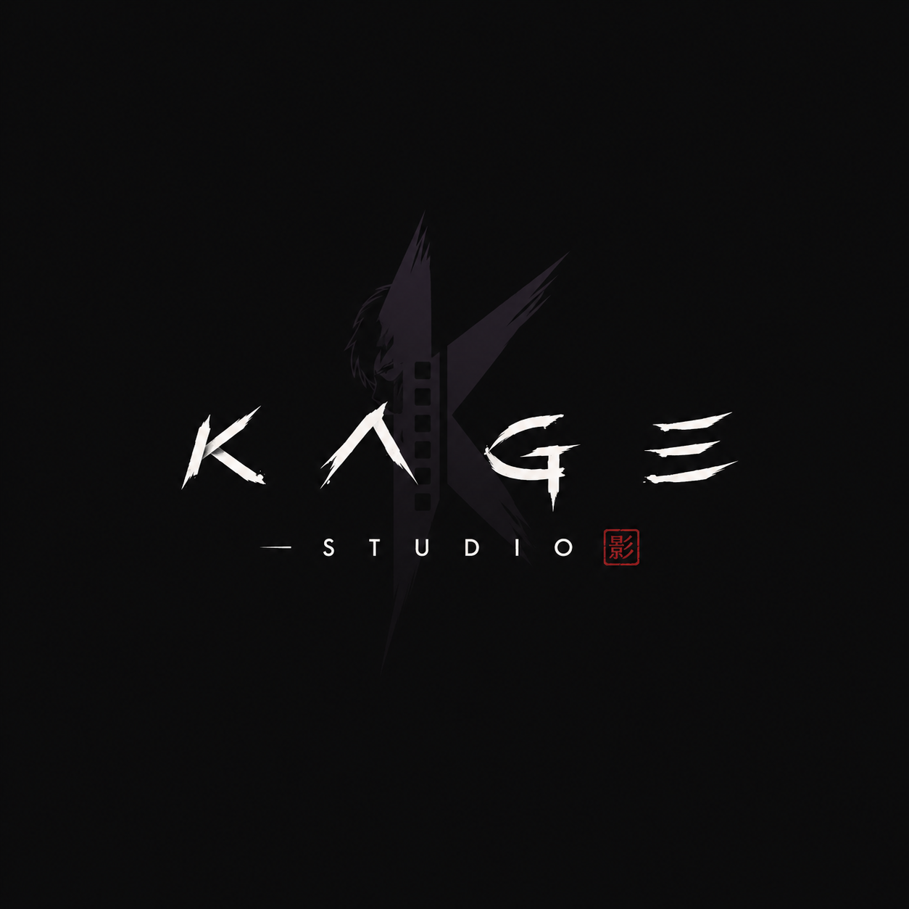

<div align="center">



### The all-in-one After Effects toolkit for anime editors

Browse anime clips · AI upscale &amp; interpolate · Flow-style easing · asset manager — all in **one panel** inside After Effects.

[](https://github.com/OrsooTR/kage-studio/releases/latest/download/KageStudioSetup.exe)
&nbsp;
[](https://orsootr.github.io/kage-studio-site/)
&nbsp;
[](https://discord.gg/Fheyv5y45D)

</div>

---

## ✨ Features

| | |
|---|---|
| 🎬 **Clips** | Browse a huge anime library, preview clips inline, and drop them straight onto your timeline — no downloading, no tab-switching. |
| ✨ **Kaizen** | AI-**upscale** (Real-ESRGAN) and frame-**interpolate** (RIFE) any clip or comp, chained, then dropped back exactly where it belongs. |
| 📈 **Graph** | A Flow-style easing editor: shape bézier curves, pick from the full easing library or save your own, and apply them to selected keyframes in one click. |
| 🗂️ **Assets** | Browse any folder on your PC with live previews for images, video, audio and 3D — select and import overlays &amp; SFX instantly. |
| 🚀 **Auto-updates** | The app and the panel keep themselves up to date. New features land automatically — no reinstalling. |

## ⬇️ Download &amp; install

1. **[Download the installer](https://github.com/OrsooTR/kage-studio/releases/latest/download/KageStudioSetup.exe)** and run it.
2. Open the **Kage Studio** app → click **Install extension**.
3. In After Effects: **Window → Extensions → Kage Studio**.

> **Requirements:** Windows · After Effects **2022 or newer**. The upscale/interpolation tools (ffmpeg, Real-ESRGAN, RIFE) can auto-install from the app's Settings.

## 🔗 Links

- 🌐 **Website:** https://orsootr.github.io/kage-studio-site/
- 📜 **Changelog:** https://orsootr.github.io/kage-studio-site/changelog.html
- 💬 **Discord:** https://discord.gg/Fheyv5y45D
- ⬇️ **Latest installer:** [KageStudioSetup.exe](https://github.com/OrsooTR/kage-studio/releases/latest/download/KageStudioSetup.exe)

## 🔄 How updates work

This repository **is** the published extension bundle. The panel reads [`version.json`](version.json) to detect new versions and pulls the latest bundle automatically; the desktop app updates itself via GitHub Releases. You never reinstall to get new panel features.

## 🗂️ Repository structure

```
CSXS/manifest.xml   → CEP extension manifest
client/             → panel UI (HTML/CSS/JS, fonts, logos, covers)
host/import.jsx     → ExtendScript host (import, render, easing, …)
version.json        → update feed (version + notes)
update.json         → repo + current version
changelog.json      → release history (drives the website changelog)
```

## ⚖️ Disclaimer

Kage Studio is an independent project and is **not affiliated with, endorsed by, or sponsored by** Adobe® (After Effects® is a trademark of Adobe) or any animation studio or rights holder. It is a tool: **you are responsible for ensuring you have the rights** to any content you use with it. See the [Terms](https://orsootr.github.io/kage-studio-site/terms.html) and [Privacy Policy](https://orsootr.github.io/kage-studio-site/privacy.html).

## License

© Kage Studio. All rights reserved. This source is published to power the auto-updater and distribution; it is **not** released under an open-source license and may not be reused, redistributed or repackaged without permission.

<div align="center"><sub>改善 · made for anime editors 🥷</sub></div>
